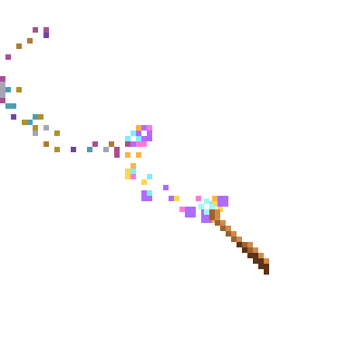

<h1 align="center">Wandful</h1>

<p align="center"><strong>A magic wand for your desktop. Hold the right mouse button,
draw a rune, and the shortcut you bound to it is cast.</strong><br>
<sub>Shortcuts are spells. The set you keep is your spellbook. Drawing one is a swish.</sub></p>

<p align="center">
  
  
  
  
  
  
</p>

<p align="center">
  
</p>

## What it is

Every app has shortcuts nobody remembers. Wandful lets you draw them instead:
a stroke you can do without looking, bound to whatever key combination — or
whatever app — you want. One small binary, a native window, no accounts, no
network.

- **A wand that follows the cursor.** Summon it from the tray, the spellbook
  window, or with `⌘⇧M` / `Ctrl+Shift+M` (changeable in Settings). Sparks trail
  behind it while you draw.
- **Right-drag is a gesture, right-click is still a click.** A right button
  press without movement reaches the app under the cursor as usual.
- **Any rune you like.** The `$1 Unistroke` recognizer is rotation-, scale- and
  position-invariant, so a rune is whatever shape you can repeat. A strictness
  setting decides how close it has to be.
- **Spells cast a shortcut or open an app.** Recorded by pressing the keys, not
  by typing their names.

**It is early.** Version 0.1, one author, two platforms. The spellbook format
may still change before 1.0; [CHANGELOG.md](CHANGELOG.md) says when it does.
Linux is not built or tested — see [ROADMAP.md](ROADMAP.md).

## Install

There are no signed releases yet: Wandful is built from source, and that takes
about a minute once the toolchain is there. Releases will appear on
[the releases page](https://github.com/ostapondo/wandful/releases) as they are
cut; each one is built by GitHub Actions and carries a provenance attestation
you can check with `gh attestation verify <file> -R ostapondo/wandful`.

**Prerequisites.** [Rust](https://rustup.rs) (stable), Node 20+, and the
[Tauri 2 prerequisites](https://v2.tauri.app/start/prerequisites/) for your
OS. On macOS that is Xcode Command Line Tools; on Windows, the Visual Studio
C++ build tools and WebView2 (already on Windows 11).

```sh
git clone https://github.com/ostapondo/wandful && cd wandful
npm install
npm run tauri dev        # run it
npm run tauri build      # or build a real app
# macOS:   src-tauri/target/release/bundle/macos/Wandful.app  (+ .dmg)
# Windows: src-tauri/target/release/bundle/nsis/*.exe / msi/*.msi
```

### macOS: the Accessibility permission

Global mouse hooks and key synthesis need **Accessibility**:
System Settings → Privacy & Security → Accessibility → enable **Wandful**.
In `tauri dev` the permission goes to whatever launched the process (Terminal,
VS Code, iTerm) — enable that instead, then restart. Without it the app shows a
banner and falls back to listen-only mode: the wand still draws, but the right
button also reaches other apps.

Ad-hoc signed builds get a new signature every time, and macOS forgets the
grant. Once:

```sh
sh scripts/make-signing-cert.sh   # creates a self-signed "Wandful Dev" identity in your keychain
npm run build:mac                 # tauri build + re-sign with that identity
```

[SECURITY.md](SECURITY.md) says exactly what the permission is used for and
what the app does not do.

### Windows

No extra permissions. Shortcuts cannot be sent into windows running as
Administrator unless Wandful also runs as Administrator. The overlay covers the
primary monitor.

## Using it

1. Toggle the wand: **left-click the tray icon** (right-click opens the menu),
   press `⌘⇧M` / `Ctrl+Shift+M`, or use the button in the spellbook window.
2. Hold the **right mouse button** anywhere and draw a rune. Release, and the
   matching spell is cast.
3. Right-click without moving still opens the normal context menu.
4. In the spellbook: draw a rune on the canvas, name it, click **Shortcut** and
   press the keys — or pick an app to open — then **Save spell**. Click a spell
   in the list to edit or delete it. The spellbook starts empty; every rune and
   shortcut is yours. **Strictness** controls how precise the rune must be.

Spells are stored in `spellbook.json` in the app config directory
(`~/Library/Application Support/com.ostap.wandful/` on macOS,
`%APPDATA%\com.ostap.wandful\` on Windows). Back it up, share it, edit it by
hand — it is plain JSON.

## How it works

| | |
| --- | --- |
| **Global hook** | `rdev`, vendored and patched, watches the mouse. A right press followed by movement is grabbed as a gesture; a press without movement is replayed to the app under the cursor |
| **Overlay** | A full-screen transparent, click-through Tauri window draws the wand and the trail on a canvas |
| **Recognizer** | `$1 Unistroke` in ~170 lines of Rust. Runes are resampled, rotated, scaled and compared by path distance; strictness is a threshold on that score |
| **Casting** | Shortcuts are typed with `enigo`; apps are opened with `open` / `start` |
| **Spellbook** | A second Tauri window in vanilla TypeScript, no framework |

```
src/                   frontend (vanilla TS)
  wand.ts              pixel wand sprite + magic trail (shared by overlay & spellbook)
  overlay.ts           full-screen transparent click-through overlay
  settings.ts          spellbook UI
  mock.ts              browser stand-in so `vite` alone previews the UI
src-tauri/src/
  lib.rs               windows, tray, hotkey, commands, worker
  hook.rs              global mouse/keyboard hook state machine
  recognizer.rs        $1 unistroke recognizer
  spells.rs            spellbook persistence
  shortcut.rs          "Cmd+Shift+S" → key presses
src-tauri/vendor/rdev  patched rdev (macOS drag events + no TSM calls off the main thread)
scripts/               icons, README media, macOS signing helpers
```

[AGENTS.md](AGENTS.md) is the engineering guide: what each file owns, the
macOS threading rules the hook has to respect, and the mistakes that already
cost an hour.

## Contributing

Bug reports, runes, and code are all welcome, and none of them needs a signing
certificate. [CONTRIBUTING.md](CONTRIBUTING.md) has how to get it building,
what to pick, and what a pull request should carry. The most useful thing to
send is a report from hardware nobody here has: a second monitor, a Windows
laptop with a trackpad, a Retina screen next to a 1× one — the
[needs-hardware](https://github.com/ostapondo/wandful/issues?q=is%3Aissue+is%3Aopen+label%3Aneeds-hardware)
label is that list.

Questions and ideas go in [Discussions](https://github.com/ostapondo/wandful/discussions).
Anything exploitable goes through [SECURITY.md](SECURITY.md), not a public
issue.

## License

[MIT](LICENSE). The vendored `rdev` in `src-tauri/vendor/rdev` is MIT as well,
by its own authors; the patches on top of it are noted inline with `PATCHED`.
