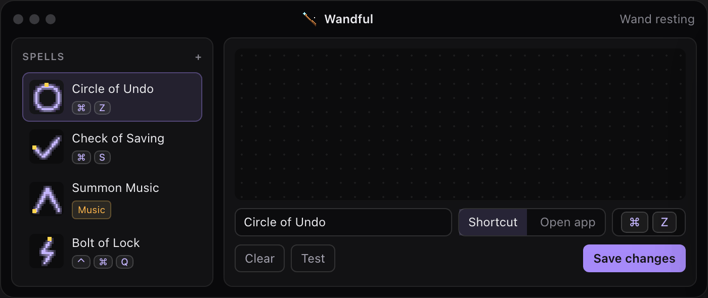

<h1 align="center">Wandful</h1>

<p align="center"><strong>Draw a shape with the mouse — a keyboard shortcut fires.</strong><br>
<sub>Press <code>⌘⇧M</code>, draw a ✓, release: Slack marks all read. Draw a circle: Terminal opens. Any shape you can repeat, any shortcut or app.</sub></p>

<p align="center"><a href="https://ostapondo.github.io/wandful/">ostapondo.github.io/wandful</a> — try the recognizer in your browser</p>

<p align="center">
  
  
  
  
  
  
  
</p>

<p align="center">
  
</p>

## What it is

Wandful is a mouse-gesture launcher for keyboard shortcuts. Instead of
remembering `⌘⇧A`, you draw a shape you can do without looking, and Wandful
types the shortcut into the app you were using — or opens the app you chose.

1. Press `⌘⇧M` (or click the menu-bar icon). The screen dims and a wand
   appears under the cursor.
2. Hold a mouse button, draw your shape, release.
3. The shortcut bound to it fires in the app you came from. Done.

- **You draw your own shapes.** No alphabet to learn: draw a shape once, name
  it, press the keys — it is bound. Draw an unknown shape and Wandful offers to
  bind it on the spot. A strictness slider decides how neat it has to be.
- **Nothing is intercepted until you call it.** Mouse and keyboard behave
  exactly as before; Wandful only listens while the wand is on screen. Click,
  `Esc`, or ✕ puts it away.
- **Small and local.** One binary, no account, no network, spells in a plain
  JSON file you own. Free, MIT.

Like BetterTouchTool's or StrokeMouse's gestures, but the shapes are yours and
it only listens when you ask. If you like the metaphor: a shortcut is a
*spell*, your set is the *spellbook*, drawing one is a *swish*.

**It is early.** Version 0.0.1, one author. The spellbook format may still
change before 1.0; [CHANGELOG.md](CHANGELOG.md) says when it does. macOS is
where it has had the most use; Windows is built, shipped, held to the same CI
and has been run on Windows 11, but it has had far less time in front of real
people — a [bug report](https://github.com/ostapondo/wandful/issues) is the
fastest way to change that. Linux is not built or tested; see [ROADMAP.md](ROADMAP.md).

## Install

**Homebrew** (Apple silicon and Intel):

```sh
brew install --cask ostapondo/tap/wandful
```

**Or the `.dmg`** from [the releases page](https://github.com/ostapondo/wandful/releases):
open it, drag Wandful to Applications. Every file there is built by GitHub
Actions and carries a provenance attestation you can check with
`gh attestation verify <file> -R ostapondo/wandful`.

**Windows**: the `.exe` (NSIS) or `.msi` installer from the same page, with the
same attestation. The installers are not code-signed, so SmartScreen warns on
the first run — **More info** → **Run anyway**. Nothing else is asked for;
Windows needs no permission grant for what Wandful does.

Builds are not notarized (that needs a paid Apple account), so the first
launch is right-click → **Open**, or `brew install --cask --no-quarantine …`.
Then macOS asks once for Accessibility — see below.

**Or from source**, which takes about a minute once the toolchain is there.

**Prerequisites.** [Rust](https://rustup.rs) (stable), Node 20+, and the
[Tauri 2 prerequisites](https://v2.tauri.app/start/prerequisites/) — on macOS
that is Xcode Command Line Tools; on Windows the MSVC toolchain
(`rustup default stable-msvc`) with the Visual Studio Build Tools "Desktop
development with C++" workload, and WebView2, which Windows 11 ships with.
The GNU toolchain does not link a Tauri app on Windows; use MSVC.

```sh
git clone https://github.com/ostapondo/wandful && cd wandful
npm install
npm run tauri dev        # run it
npm run tauri build      # or build a real app
# macOS:   src-tauri/target/release/bundle/macos/Wandful.app  (+ .dmg)
# Windows: src-tauri/target/release/bundle/nsis/*.exe          (+ msi/*.msi)
```

### macOS: the Accessibility permission

Global mouse hooks and key synthesis need **Accessibility**:
System Settings → Privacy & Security → Accessibility → enable **Wandful**.
In `tauri dev` the permission goes to whatever launched the process (Terminal,
VS Code, iTerm) — enable that instead, then restart. Without it the app shows a
banner: the wand still draws and runes are still recognised, but shortcuts
cannot be typed into other apps.

Ad-hoc signed builds get a new signature every time, and macOS forgets the
grant. Once:

```sh
sh scripts/make-signing-cert.sh   # creates a self-signed "Wandful Dev" identity in your keychain
npm run build:mac                 # tauri build + re-sign with that identity
```

[SECURITY.md](SECURITY.md) says exactly what the permission is used for and
what the app does not do.

### Windows: what differs

Nothing to grant — the low-level hooks Windows uses need no permission. Three
things behave differently from macOS:

- **A window running as administrator is out of reach.** Windows will not let
  an ordinary process type into one that runs with more privilege than it has,
  and gives no error when it refuses — the keys simply go nowhere. Wandful
  checks before it casts and says so instead. Start Wandful as administrator
  to reach those windows.
- **The overlay covers the primary monitor.** Multi-monitor is on
  [ROADMAP.md](ROADMAP.md).
- **The wand never takes focus**, so summoning it does not interrupt what you
  were typing. The new-spell panel is the exception — it needs the keyboard —
  and it hands focus back to the app underneath when it closes.

#### Shortcuts Windows keeps for itself

In the spellbook you *build* a shortcut rather than press it — click the keys,
or press the combination into the panel — so what the OS would have eaten on
the way never comes up. Casting is the half that has limits, and two
combinations no application can send:

| Combination | Build | Cast | Why |
|---|---|---|---|
| `Ctrl+Alt+Del` | yes | no | The Secure Attention Sequence. The kernel takes it before any hook sees it, and `SendInput` cannot produce it. This is what makes the sign-in screen impossible to spoof. |
| `Win+L` | yes | no | Windows locks the screen itself, ahead of anything an application sends. |

Both are refused when you build them, with the reason, rather than saved as a
spell that does nothing.

For what people actually want from that screen, use a **System** spell instead
of trying to fake the keys: it locks, signs out, switches user, opens Task
Manager or sleeps by calling the same APIs those menu items do — no elevation,
no policy change. Task Manager also works as an ordinary **Open app** spell
pointing at `C:\Windows\System32\Taskmgr.exe`.

## Using it

1. Summon the wand: **left-click the menu-bar icon** (right-click opens the
   menu), press `⌘⇧M`, or use the button in the spellbook window.
2. Hold **any mouse button** and draw a rune. Release, and the matching spell
   is cast into the app you were in; the wand goes away by itself.
3. Drew something no spell knows? The wand offers **Make it a spell** right
   there (or press `N`): name it, press the keys — the wand holds them back
   from the app underneath while it listens — or pick an app, save.
4. Changed your mind? Click without drawing, press `Esc`, or hit the ✕ in the
   corner.
5. In the spellbook: draw a rune on the canvas, name it, click **Shortcut** and
   build the combination — click the keys, or just press them — or pick an app
   to open, then **Save spell**. Click a spell in the list to edit or delete
   it. The spellbook starts empty; every rune and shortcut is yours.
   **Strictness** controls how precise the rune must be.

<p align="center">
  
</p>

Spells are stored in `spellbook.json` in the app config directory
(`~/Library/Application Support/com.ostap.wandful/` on macOS,
`%APPDATA%\com.ostap.wandful\` on Windows). Back it up, share it, edit it by
hand — it is plain JSON.

## How it works

| | |
| --- | --- |
| **Global hook** | `rdev`, vendored and patched, watches the keyboard only: `Esc` while the wand is out, and the keys while the overlay's new-spell panel records a shortcut. Nothing is grabbed while the wand is away |
| **Overlay** | A full-screen transparent Tauri window, hidden until the wand is summoned. It handles the mouse itself and draws the wand and the trail on a canvas. On macOS it takes focus while it is up (a window there only gets mouse-moved events while its app is active) and hands it back before the cast; on Windows it never takes focus at all, apart from that panel |
| **Recognizer** | `$1 Unistroke` in ~170 lines of Rust. Runes are resampled, rotated, scaled and compared by path distance; strictness is a threshold on that score |
| **Casting** | Shortcuts are typed with `enigo`; apps are opened with `open` (macOS) or `ShellExecute` (Windows) |
| **Spellbook** | A second Tauri window: React + zustand, one small CSS file |

[AGENTS.md](AGENTS.md) is the engineering guide: what each file owns, the
macOS threading rules the hook has to respect, and the mistakes that already
cost an hour.

## Contributing

Bug reports, runes, and code are all welcome, and none of them needs a signing
certificate. [CONTRIBUTING.md](CONTRIBUTING.md) has how to get it building,
what to pick, and what a pull request should carry. The most useful thing to
send is a report from hardware nobody here has: a second monitor, any Windows
machine at all, a Retina screen next to a 1× one — the
[needs-hardware](https://github.com/ostapondo/wandful/issues?q=is%3Aissue+is%3Aopen+label%3Aneeds-hardware)
label is that list.

Questions and ideas go in [Discussions](https://github.com/ostapondo/wandful/discussions).
Anything exploitable goes through [SECURITY.md](SECURITY.md), not a public
issue.

## License

[MIT](LICENSE). The vendored `rdev` in `src-tauri/vendor/rdev` is MIT as well,
by its own authors; the patches on top of it are noted inline with `PATCHED`.
